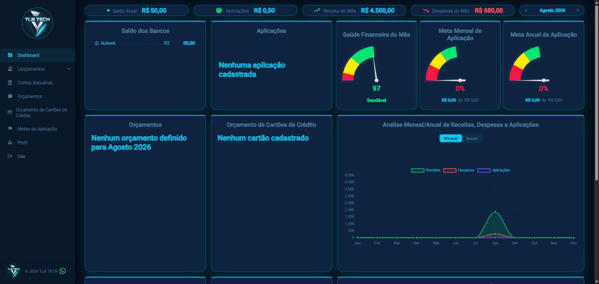
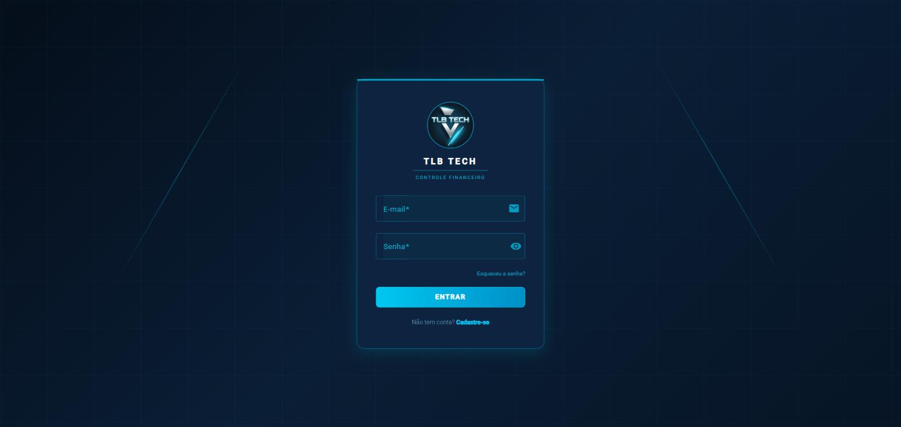
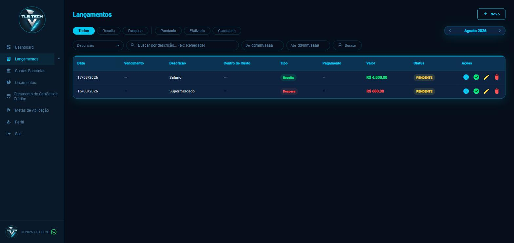

# 💰 Controle Financeiro Pessoal

> Aplicação de controle financeiro pessoal desenvolvida com arquitetura de microsserviços, utilizando Java + Spring Boot, Angular e Docker.


---

<p align="center">
  
</p>
<p align="center">
  
  
</p>

---

## 📋 Sobre o Projeto

Aplicação full-stack para controle de finanças pessoais, com foco em **aprendizado de arquitetura distribuída** e construção de **portfólio profissional**.

O projeto foi desenvolvido seguindo boas práticas de mercado: microsserviços independentes, comunicação via REST, autenticação JWT centralizada no API Gateway, resiliência com Resilience4j e orquestração com Docker Compose. Conta com notificações automáticas de vencimentos por **e-mail** e **WhatsApp**, e com um modelo de **assinatura paga via Mercado Pago** (trial + assinatura recorrente) que controla o acesso à aplicação.

---

## 🏗️ Arquitetura

```
┌──────────────────────────────────────────────────────────────────┐
│                      Angular Frontend (4200)                     │
└───────────────────────────────┬──────────────────────────────────┘
                                 │
┌────────────────────────────────▼──────────────────────────────────┐
│           API Gateway — Spring Cloud Gateway (8080)                │
│   JWT Validation · Verificação de assinatura ativa · Roteamento    │
└──┬────────┬─────────┬─────────┬─────────┬─────────┬────────┬──────┘
   │        │         │         │         │         │        │
┌──▼───┐ ┌─▼────┐ ┌──▼───┐ ┌───▼──┐ ┌────▼───┐ ┌───▼───┐    │
│  ms- │ │  ms- │ │  ms- │ │  ms- │ │   ms-  │ │  ms-  │    │
│usuár.│ │c.cus.│ │lanc. │ │fluxo │ │ contas │ │orçam. │    │
│(8081)│ │(8082)│ │(8083)│ │(8084)│ │ (8087) │ │(8088) │    │
└──┬───┘ └──────┘ └──────┘ └──────┘ └────────┘ └───────┘    │
   │  db por serviço (PostgreSQL)                            │
   │ Mercado Pago (assinatura)                                │
   │                                          ┌────────────────▼───┐
┌──▼──────────────────────────────┐          │  bff-financeiro     │
│  ms-notificacao (8086)          │          │      (8085)         │
│  Scheduler diário de vencimentos│          │ Agrega: lanc. +      │
│  Email (SendGrid) + WhatsApp    │          │ c.custo + fluxo      │
└──┬───────────────────────────────┘         └──────────────────────┘
   │
┌──▼──────────────┐
│ Evolution API    │
│    (8089)        │
└───────────────────┘
```

### Por que essa arquitetura?

| Decisão | Motivo |
|---|---|
| Microsserviços | Escalabilidade independente por domínio |
| API Gateway | Ponto único de entrada, JWT centralizado e verificação de assinatura ativa |
| BFF | Agrega dados complexos para o frontend |
| Resilience4j | Evita falhas em cascata entre serviços |
| Um banco por serviço | Isolamento de dados, sem acoplamento |
| Header interno (`X-Internal-Secret`) | Protege endpoints de comunicação serviço-a-serviço |
| Evolution API | Integração WhatsApp sem custo via API aberta |
| Mercado Pago | Assinatura recorrente (trial + plano mensal) controlando acesso à aplicação |

---

## 🛠️ Stack Tecnológica

| Camada | Tecnologia |
|---|---|
| Backend | Java 17 + Spring Boot 3.x |
| API Gateway | Spring Cloud Gateway |
| Comunicação | REST + OpenFeign / WebClient |
| Resiliência | Resilience4j (Circuit Breaker, Retry, Timeout) |
| Autenticação | JWT + Spring Security |
| Pagamentos | Mercado Pago (assinatura recorrente + webhook HMAC) |
| Banco de Dados | PostgreSQL 15 + Flyway |
| Frontend | Angular 20 (standalone components) + Angular Material + Chart.js |
| Orquestração | Docker + Docker Compose |
| Documentação | Swagger / OpenAPI 3 |
| Testes | JUnit 5 + Mockito |
| E-mail | SendGrid |
| WhatsApp | Evolution API v2 |
| CI/CD | GitHub Actions (build + testes por serviço) |

---

## 📦 Estrutura do Projeto

```
controle-financeiro/                 # monorepo — todos os serviços e o frontend vivem aqui
├── .github/workflows/                # um pipeline de CI por serviço (dispara só quando a pasta muda)
├── controle-financeiro-infra/        # Docker Compose + infra
├── api-gateway/                      # Spring Cloud Gateway — porta 8080
├── ms-usuarios/                      # Usuários + Autenticação + Assinatura — porta 8081
├── ms-centro-custo/                  # Centro de Custo — porta 8082
├── ms-lancamentos/                   # Lançamentos + Cartão de Crédito — porta 8083
├── ms-fluxo-caixa/                   # Fluxo de Caixa — porta 8084
├── bff-financeiro/                   # Backend for Frontend — porta 8085
├── ms-notificacao/                   # Notificações — porta 8086
├── ms-contas/                        # Contas e Tipos de Conta — porta 8087
├── ms-orcamento/                     # Orçamentos e Metas de Aplicação — porta 8088
└── CotroleFinanceiroFront/           # Aplicação Angular — porta 4200
    └── controle-financeiro-front/
```

---

## 📋 Módulos

### 👤 ms-usuarios (8081)
- Cadastro, autenticação (JWT) e recuperação/redefinição de senha
- CRUD completo de usuários e perfil
- Assinatura via Mercado Pago: criação de assinatura recorrente (`AssinaturaController`), endpoint interno de consulta de status (`AssinaturaInternoController`) e webhook de notificações do Mercado Pago validado por assinatura HMAC (`WebhookMercadoPagoController`)

### 🗂️ ms-centro-custo (8082)
- Cadastro de centros de custo
- CRUD completo
- Vinculação com lançamentos
- Endpoint interno protegido por `X-Internal-Secret`

### 💸 ms-lancamentos (8083)
- Registro de receitas e despesas com múltiplas formas de pagamento (PIX, boleto, cartão, dinheiro, transferência)
- Lançamentos parcelados (boleto e cartão de crédito) e cadastro de cartões de crédito
- Efetivação de lançamentos, integrada de forma atômica com `ms-contas` (débito real na conta ao efetivar)
- Tipos de juros configuráveis
- Vinculação com centros de custo via OpenFeign
- Movimentações bancárias vinculadas a contas (`ContaClient`)

### 📊 ms-fluxo-caixa (8084)
- Relatórios financeiros consolidados
- Extrato por período, saldo atual e projeções
- Consome `ms-lancamentos` via OpenFeign + Resilience4j

### 🖥️ bff-financeiro (8085)
- Agrega em uma única chamada: lançamentos, centros de custo e fluxo de caixa
- Simplifica o consumo de dados pelo frontend (dashboard)

### 🔔 ms-notificacao (8086)
- Alertas automáticos de lançamentos vencendo (scheduler diário)
- Notificação por **e-mail** via SendGrid
- Notificação por **WhatsApp** via Evolution API (flag `whatsapp.enabled`)
- Preferências de notificação por usuário (e-mail, WhatsApp ou ambos)

### 🏦 ms-contas (8087)
- Cadastro de contas bancárias/carteiras e tipos de conta
- Extrato e transferência entre contas
- Endpoint interno usado pelo `ms-lancamentos` para debitar/creditar ao efetivar um lançamento
- Saldo pode ficar negativo — o serviço não bloqueia saldo insuficiente (decisão de negócio, não trava de sistema)

### 🎯 ms-orcamento (8088)
- Orçamentos gerais e por cartão de crédito
- Metas de aplicação financeira
- Endpoint interno protegido por `X-Internal-Secret`

---

## 🌐 Frontend — Angular 20

Standalone components com lazy loading por rota, Angular Material e Chart.js para os gráficos.

| Tela | Rota | Descrição |
|---|---|---|
| Login | `/login` | Autenticação do usuário |
| Cadastro | `/cadastro` | Criação de conta |
| Recuperar senha | `/recuperar-senha` | Solicitação de redefinição por e-mail |
| Redefinir senha | `/redefinir-senha` | Definição de nova senha via token |
| Dashboard | `/dashboard` | Visão geral financeira consolidada |
| Lançamentos | `/lancamentos` | Gestão de receitas e despesas |
| Centro de Custo | `/centro-custo` | Gestão de categorias financeiras |
| Cartões | `/cartoes` | Gestão de cartões de crédito |
| Contas | `/contas`, `/contas/:id/extrato` | Contas, extrato e transferência |
| Tipos de Conta | `/tipos-conta` | Cadastro de tipos de conta |
| Orçamentos | `/orcamentos` | Orçamento geral por período |
| Orçamento por Cartão | `/orcamento-cartoes` | Orçamento vinculado a cartão de crédito |
| Metas | `/metas` | Metas de aplicação financeira |
| Assinatura | `/assinatura` | Contratação/gestão da assinatura (Mercado Pago) |
| Perfil | `/perfil` | Dados e foto do usuário |

`authGuard` protege as rotas autenticadas; `auth.interceptor` injeta o token JWT em todas as requisições e `assinatura.interceptor` trata o bloqueio de acesso quando a assinatura está inativa.

---

## 🚀 Como Executar

### Pré-requisitos
- Docker e Docker Compose instalados
- Java 17+
- Node.js 18+ (para o frontend)

### Subindo o projeto completo

```bash
# Clone o monorepo
git clone https://github.com/TLB-TECH/controle-financeiro.git
cd controle-financeiro/controle-financeiro-infra

# Configure as variáveis de ambiente
cp .env.example .env
# Edite o .env com suas credenciais

# Sobe todos os serviços
docker compose up -d

# Acompanha os logs
docker compose logs -f
```

### Rodando o frontend isoladamente

```bash
cd CotroleFinanceiroFront/controle-financeiro-front
npm install
npm start
```

### Variáveis de ambiente necessárias (.env)

```env
POSTGRES_USER=postgres
POSTGRES_PASSWORD=sua_senha

JWT_SECRET=seu_jwt_secret
JWT_EXPIRATION=86400000

INTERNAL_SECRET=internal-secret-financeiro-2026

# SendGrid (e-mail)
SENDGRID_API_KEY=sua_chave
SENDGRID_FROM_EMAIL=seu@email.com

# Evolution API (WhatsApp)
EVOLUTION_API_URL=http://evolution-api:8080
EVOLUTION_API_KEY=sua_chave
EVOLUTION_INSTANCE=sua_instancia

# Mercado Pago (assinatura) — atenção: sem conta sandbox configurada,
# o checkout usa conta real e pode gerar cobrança de verdade
MP_ACCESS_TOKEN=seu_access_token
MP_WEBHOOK_SECRET=seu_webhook_secret
```

### Serviços disponíveis após o start

| Serviço | URL |
|---|---|
| Frontend Angular | http://localhost:4200 |
| API Gateway | http://localhost:8080 |
| BFF | http://localhost:8085/swagger-ui.html |
| ms-usuarios | http://localhost:8081/swagger-ui.html |
| ms-centro-custo | http://localhost:8082/swagger-ui.html |
| ms-lancamentos | http://localhost:8083/swagger-ui.html |
| ms-fluxo-caixa | http://localhost:8084/swagger-ui.html |
| ms-notificacao | http://localhost:8086/swagger-ui.html |
| ms-contas | http://localhost:8087/swagger-ui.html |
| ms-orcamento | http://localhost:8088/swagger-ui.html |
| Evolution API | http://localhost:8089 |

---

## ⚙️ CI/CD

Cada microsserviço tem seu próprio pipeline em `.github/workflows/`, com `paths:` restringindo o gatilho à pasta do respectivo serviço — um push que só mexe em `ms-lancamentos/` não dispara CI de `ms-contas`, por exemplo:

| Serviço | O que roda |
|---|---|
| ms-usuarios / ms-lancamentos | Build + testes (`mvn verify`), banco Postgres de serviço |
| ms-centro-custo / ms-notificacao | Build + testes (`mvn verify`), banco Postgres de serviço |
| api-gateway / bff-financeiro / ms-fluxo-caixa | Build + testes (`mvn verify`) |
| ms-contas / ms-orcamento | Build + push de imagem Docker para o GHCR (`-DskipTests`) |

Os testes que sobem o contexto Spring completo (`@SpringBootTest`) exigem que os secrets usados nos `@Value` (`JWT_SECRET`, `INTERNAL_SECRET`, e no caso do ms-usuarios também `MP_ACCESS_TOKEN`/`MP_WEBHOOK_SECRET`) estejam cadastrados uma única vez nas configurações deste repositório, em **Settings → Secrets and variables → Actions**.

---

## 🗺️ Roadmap

- [x] Definição da arquitetura
- [x] Configuração dos bancos de dados
- [x] ms-usuarios — CRUD + JWT + assinatura via Mercado Pago
- [x] ms-centro-custo — CRUD
- [x] ms-lancamentos — CRUD + parcelamentos + cartão de crédito + integração atômica com ms-contas
- [x] ms-fluxo-caixa — Relatórios + Resilience4j
- [x] bff-financeiro — Agregação de dados (dashboard)
- [x] API Gateway — Roteamento + Segurança JWT + verificação de assinatura ativa
- [x] ms-notificacao — E-mail + WhatsApp + scheduler
- [x] ms-contas — Contas, tipos de conta, extrato e transferência
- [x] ms-orcamento — Orçamentos, orçamento por cartão e metas de aplicação
- [x] Docker Compose — Orquestração completa
- [x] Frontend Angular — Autenticação completa, dashboard, lançamentos, centro de custo, cartões, contas, orçamentos, metas, assinatura, perfil
- [x] CI/CD com GitHub Actions (build + testes por serviço)
- [ ] Sandbox de testes do Mercado Pago configurado (hoje o checkout usa conta real)
- [ ] Testes unitários e de integração (meta: 80%+)

---

## 🧪 Testes

```bash
# Roda os testes de um microsserviço
cd ms-lancamentos
./mvnw test

# Roda com relatório de cobertura
./mvnw test jacoco:report
```

Meta de cobertura: **80%+**

---

## 📂 Repositório

Todo o sistema — os oito microsserviços, o API Gateway, o BFF, a infraestrutura Docker e o frontend
Angular — vive neste único repositório: [TLB-TECH/controle-financeiro](https://github.com/TLB-TECH/controle-financeiro).
Cada serviço mantém seu histórico de commits original (importado via `git subtree`), mas o
desenvolvimento, as issues e o CI/CD passam a ser centralizados aqui.

---

## 👨‍💻 Autor

**Tacio** — [@Taciolb](https://github.com/Taciolb) | [TLB-TECH](https://github.com/TLB-TECH)

---

## 📄 Licença

Este projeto está sob a licença MIT.
